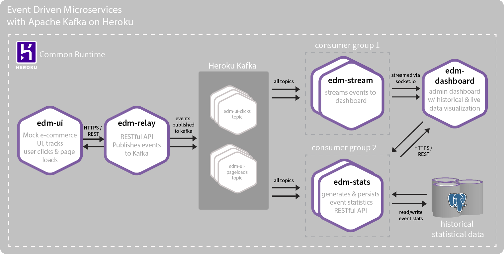

# edm-terraform

Use terraform to create and deploy all 5 `edm` applications:

1. [edm-relay](https://github.com/trevorscott/edm-relay)
1. [edm-stream](https://github.com/trevorscott/edm-stream)
1. [edm-stats](https://github.com/trevorscott/edm-stats)
1. [edm-ui](https://github.com/trevorscott/edm-ui)
1. [edm-dashboard](https://github.com/trevorscott/edm-dashboard)

Additionally two data services are created as well:

1. a `hobby-dev` PostgreSQL database
1. a `basic-0` multi-tenant Apache Kafka on Heroku cluster (not free!)

You can read about this architecture in the Heroku Dev Center article: [Event Driven Microservices with Apache Kafka](https://devcenter.heroku.com/articles/event-driven-microservices-with-apache-kafka).



## Requirements

1. Heroku Account
1. [Terraform](https://www.terraform.io/downloads.html)
1. [PostgreSQL](https://devcenter.heroku.com/articles/heroku-postgresql#local-setup)
1. [Heroku Kafka CLI Plugin](https://devcenter.heroku.com/articles/kafka-on-heroku#preparing-your-development-environment)

If you haven't already, create a Heroku account and [install the Heroku CLI](https://devcenter.heroku.com/articles/heroku-cli#download-and-install). 

Once you have the Heroku CLI installed, install the Heroku Kafka CLI plugin:

```bash
heroku plugins:install heroku-kafka
```

Additionally you'll need to make sure that you have [Terraform set up on your machine](https://www.terraform.io/downloads.html).

[Follow instructions here to set up PostgreSQL locally](https://devcenter.heroku.com/articles/heroku-postgresql#local-setup
)

Now you're ready to run the Terraform config that sets up this system.

## Config

### Heroku Authorization

Authorization tokens used with Terraform must have *global* scope to perform the various create, read, update, & delete actions on the Heroku API. If you want to isolate Terraform's capabilities from your existing account, then it should be authorized using a separate Heroku account.

First, check your current login to confirm that you're using the account intended for Terraform. If you want to switch identities, logout & then login as intended using the [Heroku CLI](https://devcenter.heroku.com/articles/heroku-cli):

```bash
heroku whoami
heroku logout
heroku login
```

Second, [generate an authorization token](https://devcenter.heroku.com/articles/heroku-cli-commands#heroku-authorizations) using the Heroku CLI. The description is a human-readable name to indicate the purpose or identity of each authorization:

```
heroku authorizations:create --description terraform-my-app
```

Once you have acquired your Heroku authorization token set it and your heroku email as enviornment variables:


```bash
export \
  TF_VAR_heroku_email='your-heroku-email' \
  TF_VAR_heroku_api_key='you-heroku-auth-token'
```

## Usage

```bash
git clone git@github.com:trevorscott/edm-terraform.git
cd edm-terraform
terraform init
```

Choose a deployment name. Keep it short as your resources will be prefixed by the chosen name.

```
terraform apply \
  -var name=<your-deployment-name>
``` 
